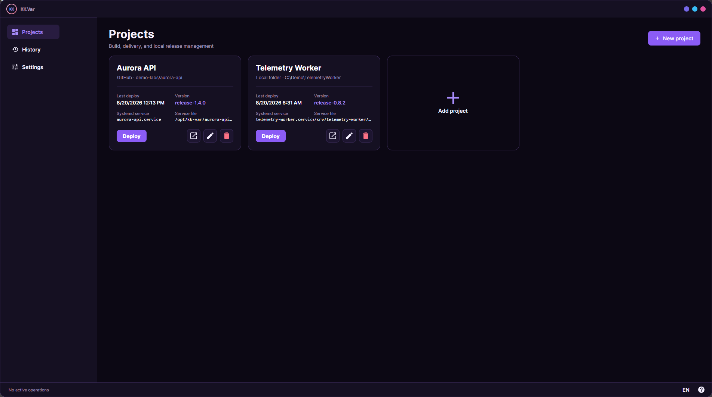
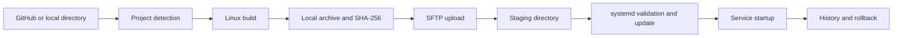
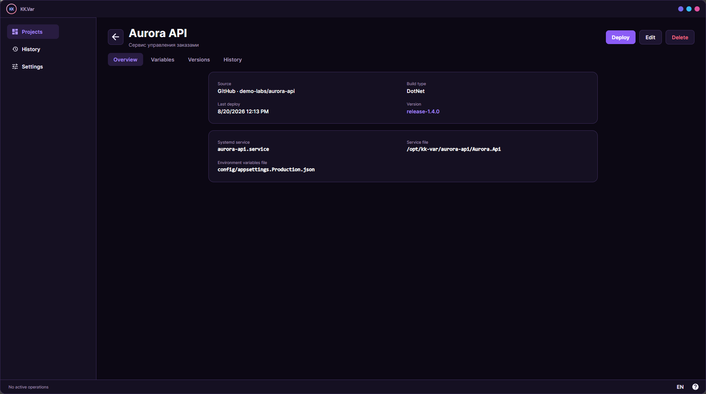
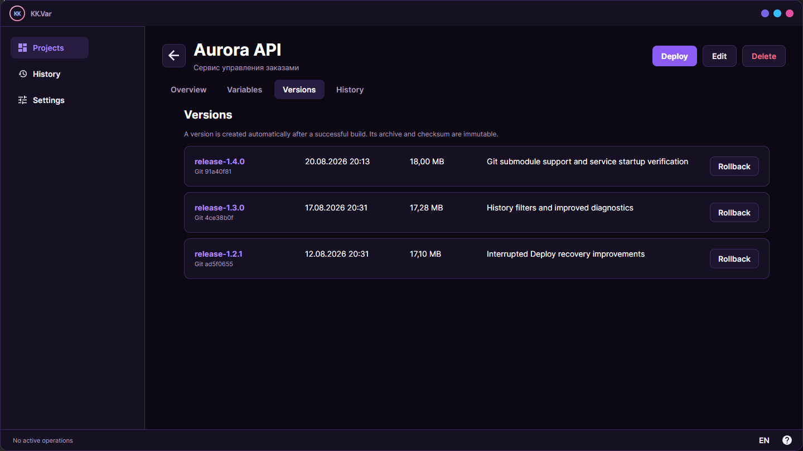
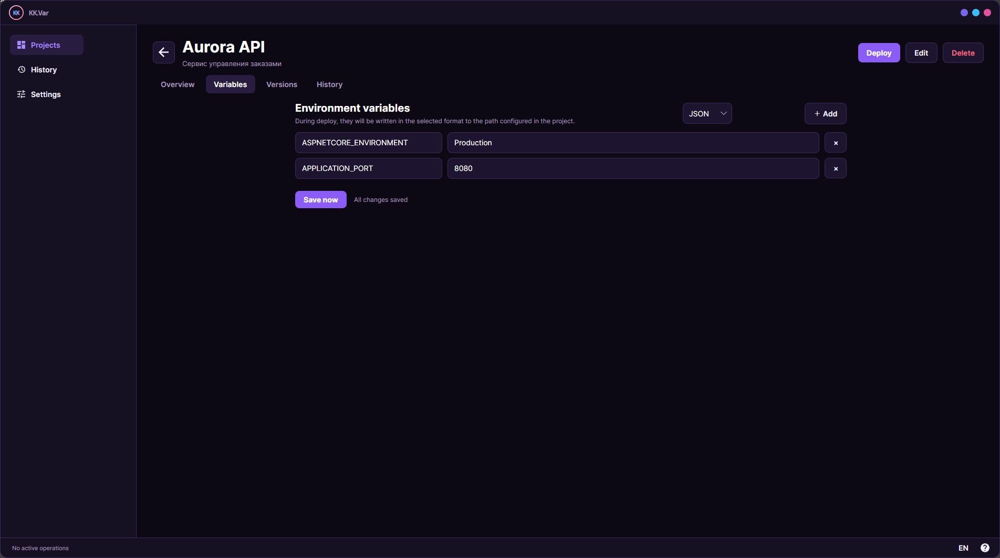
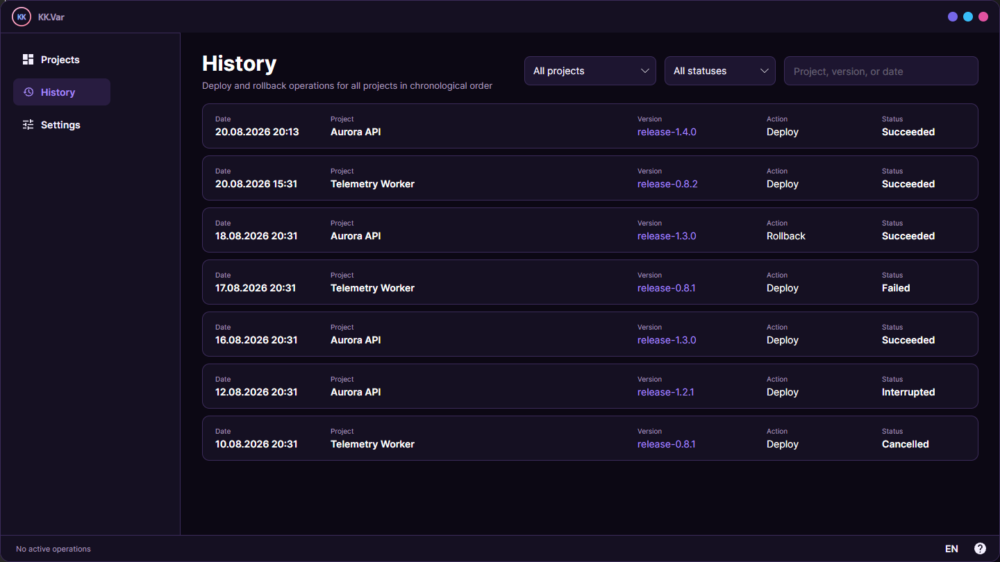
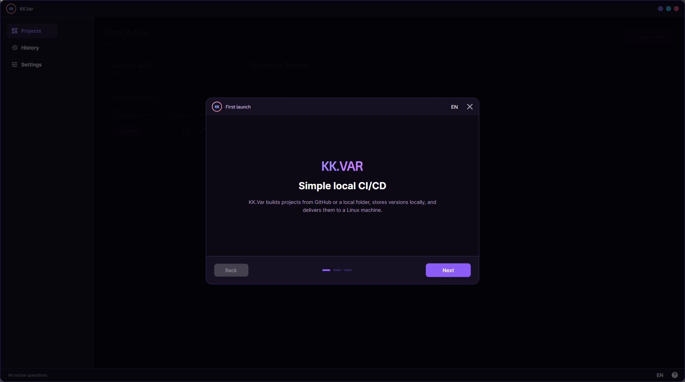
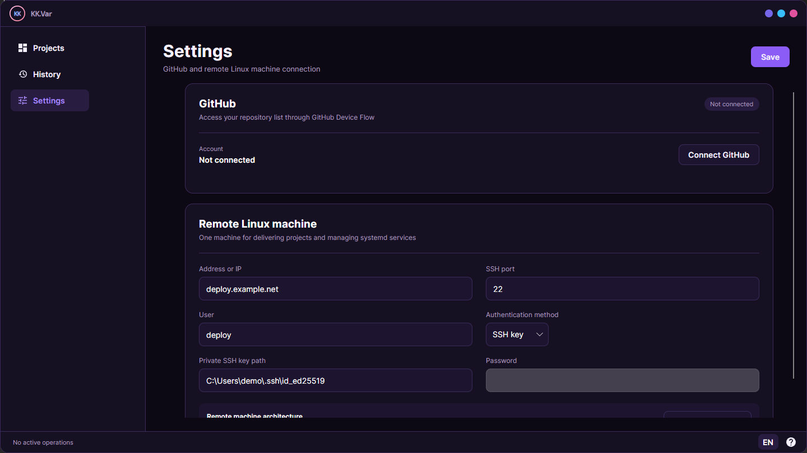

<p align="center"></p>
<h1 align="center">KK.Var</h1>
<p align="center"><strong>Simple local CI/CD for delivering applications to Linux machines</strong></p>
<p align="center"><a href="README.md">Русский</a> · <a href="README.en.md">English</a></p>
<p align="center">
  
  
  
  
</p>

> [!IMPORTANT]
> KK.Var 0.1.0 is the first public release. The management application supports Windows only, while deploy targets Linux machines running systemd.



## The idea

KK.Var is a desktop application for small projects that do not need dedicated CI/CD infrastructure. It runs on the developer's computer, obtains source code from GitHub or a local directory, builds a release, stores it locally, and delivers it to a remote Linux machine over SSH.

No separate agent needs to be installed on the server. KK.Var uploads the prepared archive, safely switches the application version, and manages the corresponding systemd service.

## Features

- projects sourced from GitHub or local directories;
- GitHub repositories downloaded together with their Git submodules;
- GitHub connection through OAuth Device Flow;
- automatic project type detection;
- .NET, Go, and C++ builds targeting the remote Linux architecture;
- Python project preparation and deployment;
- a custom build command for other project types;
- immutable local version archives with SHA-256 checksums and Git commit SHAs for GitHub sources;
- user-defined release tags and descriptions;
- deploy and rollback from the graphical interface;
- interrupted Deploy recovery after an application or computer crash;
- systemd unit creation and updates;
- `daemon-reload` only when the unit file is created or changed;
- service startup verification through `systemctl`;
- deploy and rollback history with search, project and status filters, and pagination;
- ordered environment variables;
- JSON, `.env`, Shell, and YAML environment file formats;
- a custom environment file name and location for each project;
- Russian and English UI with live language switching;
- local settings and SQLite database storage;
- GitHub token and SSH password protection through Windows DPAPI;
- SSH server fingerprint confirmation and verification;
- additional build arguments and build-process environment variables through JSON configuration.

## How deploy works



During delivery, KK.Var checks SSH access, architecture, and available disk space, uploads the release into a staging directory, and only then switches the working directory. If an operation fails after the switch, the application attempts to restore the previous release and unit file.

Version archives remain on the local computer. The remote machine keeps only the current working release, making KK.Var suitable for servers with limited disk space.

## Supported platforms

| Component | Support |
|---|---|
| Management application | Windows |
| Target machine | Linux with systemd |
| Linux architecture | x86_64/amd64 and arm64/aarch64 |
| Source | GitHub or a local Windows directory |

Linux and macOS builds are not currently distributed: GitHub token storage relies on Windows DPAPI, and the application is presently tested for Windows.

## Supported projects

| Type | Auto-detection | Current behavior |
|---|---:|---|
| .NET | ✅ | `dotnet publish`, using Release and self-contained `linux-x64` or `linux-arm64` by default |
| Go | ✅ | `go build` with `GOOS=linux`; the target architecture is detected automatically |
| Python | ✅ | source delivery, remote `.venv` creation, and dependency installation |
| C++ | ✅ | CMake build using a user-provided Linux toolchain file |
| Custom build | manual | direct user command with a controlled output directory |

KK.Var looks for `.sln`/`.slnx` and `.csproj`, `go.mod`, `pyproject.toml`, `requirements.txt`, Python files, `CMakeLists.txt`, and C++ sources. If several candidates are found, the build method must be selected manually.

### Build parameters

A project can provide additional build parameters as JSON:

```json
{
  "configuration": "Release",
  "configureArguments": [],
  "buildArguments": ["--verbosity", "minimal"],
  "environment": {
    "NUGET_XMLDOC_MODE": "skip"
  }
}
```

`configuration` selects the configuration, `buildArguments` are added to `dotnet publish`, `go build`, `cmake --build`, or `pip install`, and `environment` is applied to the local build process. C++ also uses `toolchainFile`, `cmakeGenerator`, and `configureArguments`.

A custom build uses `command`, `workingDirectory`, and `buildArguments`. It supports `{source}`, `{output}`, `{runtime}`, and `{architecture}` placeholders and matching `KKVAR_*` environment variables. The command must place deployable files in `{output}` and is executed directly without an implicit `cmd.exe`.

## Projects and versions

A project stores its source, build method, systemd service name, remote directory, executable, and environment file path. A successful build produces a local version containing a user-defined tag, description, archive, checksum, and Git commit SHA for a GitHub source.

**Project overview**



**Locally stored versions and Rollback**



Rollback uses the selected version's existing local archive, so KK.Var does not need to fetch and build the source again.

## Environment variables

Variables are configured per project, retain their user-defined order, and are written to the selected file during deploy. The path is not limited to `.env` or `environment`; for example, it can be `config/appsettings.Production.json` or `config/runtime.env`.



KK.Var project environment variables are not intended for secrets. Passwords, private keys, and other sensitive values should not be added to them.

## Operation history

The global history combines Deploy and Rollback operations for every project. It supports project and status filters, while search accepts a project name, version tag, or date. Records are loaded page by page and include successful, failed, interrupted, and cancelled operations.



## Requirements

### Local computer

- Windows;
- .NET 10 SDK to build KK.Var from source;
- the toolchain required by the deployed project: .NET SDK or Go;
- CMake, Ninja, and a Linux cross-toolchain for C++ projects;
- GitHub access when a GitHub repository is used;
- network access to the target Linux machine.

### Remote machine

- Linux with systemd;
- SSH and SFTP;
- `systemctl` and `tar`;
- a user allowed to run the required commands through `sudo` without an interactive password prompt;
- `python3`, the `venv` module, and `pip` for Python projects.

KK.Var detects the architecture with `uname -m` during the SSH connection check, so the user does not need to enter it manually.

## Installation

1. Open [GitHub Releases](https://github.com/KavvaiiKira/KK.Var/releases/latest).
2. Download `KK.Var-0.1.0-win-x64.zip` for standard 64-bit Windows or `KK.Var-0.1.0-win-x86.zip` when a 32-bit build is required.
3. Optionally compare the archive's SHA-256 with the value published in the release notes.
4. Extract the archive into a separate directory and run `KK.Var.exe`.

Published builds are self-contained, so users do not need the .NET Runtime or .NET SDK to run KK.Var. The first release is not signed with a commercial certificate, so Windows SmartScreen may warn about an unknown publisher. Confirm that the archive came from this repository's release page and verify its SHA-256.

## Build from source

```powershell
git clone https://github.com/KavvaiiKira/KK.Var.git
cd KK.Var
dotnet restore
dotnet run --project KK.Var/KK.Var.csproj
```

To create self-contained release archives, run:

```powershell
.\build-release.ps1
```

The script creates `KK.Var-0.1.0-win-x86.zip` for 32-bit Windows and `KK.Var-0.1.0-win-x64.zip` for 64-bit Windows in `artifacts/release`. Users of these archives do not need the .NET SDK.

## First launch

On first launch, the application opens a setup wizard. To get started, provide:

1. the Linux machine address and SSH port;
2. the SSH user name;
3. an authentication method - private SSH key or password;
4. compare and confirm the SSH server fingerprint;
5. verify the connection and save the settings.

GitHub can be connected immediately or later. Authorization uses Device Flow: the application displays a one-time code and opens GitHub, while the resulting access token is encrypted and stored locally. If GitHub revokes the token or the user revokes access in their account settings, GitHub must be connected again.

To access private repositories, the OAuth App requests the `repo read:user` scopes. GitHub describes `repo` as full control of private repositories, although KK.Var uses the token only to read the repository list, commit SHAs, Git trees, submodules, and source archives. Access can be revoked from GitHub's connected application settings or with the disconnect button in KK.Var settings.



After the wizard, the same options remain available on the Settings page, where the SSH connection can be changed and verified and GitHub can be connected or disconnected.



## Local data

Application data is stored in `%LOCALAPPDATA%\KK.Var`:

- `settings.json` - application and connection settings without the SSH password;
- `kk-var.db` - projects, versions, variables, and operation history;
- `artifacts` - local version archives;
- `logs` - diagnostic logs;
- `github-token.dat` - GitHub token protected by Windows DPAPI;
- `ssh-password.dat` - SSH password protected by Windows DPAPI;
- `recovery` - backups of damaged settings or SQLite files created through the recovery screen.

If `settings.json` is damaged or SQLite cannot be opened, the application shows a recovery screen instead of terminating. Reset happens only after confirmation, and the original files are preserved under `recovery`.

Deleting a project also deletes its local version archives.

Review diagnostic logs before publishing them. Do not commit or share `github-token.dat` or `ssh-password.dat`.

## Current limitations

- the management application runs on Windows only;
- deploy targets Linux machines and systemd services only;
- only one deploy or rollback can run at a time;
- KK.Var does not manage database migrations or backups for deployed applications;
- the remote machine must already be reachable over SSH and allow the required `sudo` commands.

## License

The source code is distributed under the [MIT License](LICENSE).

### Third-party licenses

- the [Exo 2](https://github.com/googlefonts/Exo-2.0) font is distributed under the SIL Open Font License 1.1; the full text is available in [`KK.Var/Assets/Fonts/Exo2-OFL.txt`](KK.Var/Assets/Fonts/Exo2-OFL.txt);
- the [Inter](https://github.com/rsms/inter) font is distributed under the [SIL Open Font License 1.1](https://github.com/rsms/inter/blob/master/LICENSE.txt) and is provided through the `Avalonia.Fonts.Inter` package.

