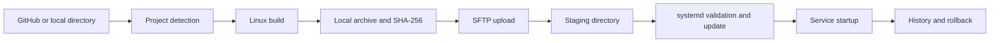

<p align="center"></p>
<h1 align="center">KK.Var</h1>
<p align="center"><strong>Simple local CI/CD for delivering applications to Linux machines</strong></p>
<p align="center"><a href="README.md">Русский</a> · <a href="README.en.md">English</a></p>
<p align="center">
  
  
  
  
</p>

> [!IMPORTANT]
> KK.Var is under active development and has no stable release yet. The management application currently supports Windows only, while deploy targets Linux machines running systemd.


## The idea

KK.Var is a desktop application for small projects that do not need dedicated CI/CD infrastructure. It runs on the developer's computer, obtains source code from GitHub or a local directory, builds a release, stores it locally, and delivers it to a remote Linux machine over SSH.

No separate agent needs to be installed on the server. KK.Var uploads the prepared archive, safely switches the application version, and manages the corresponding systemd service.

## Features

- projects sourced from GitHub or local directories;
- GitHub connection through OAuth Device Flow;
- automatic project type detection;
- .NET and Go builds targeting the remote Linux architecture;
- Python project preparation and deployment;
- immutable local version archives with SHA-256 checksums;
- user-defined release tags and descriptions;
- deploy and rollback from the graphical interface;
- systemd unit creation and updates;
- `daemon-reload` only when the unit file is created or changed;
- service startup verification through `systemctl`;
- searchable and filterable deploy and rollback history;
- ordered environment variables;
- JSON, `.env`, Shell, and YAML environment file formats;
- a custom environment file name and location for each project;
- Russian and English UI with live language switching;
- local settings and SQLite database storage;
- GitHub token protection through Windows DPAPI.

## How deploy works



During delivery, KK.Var checks SSH access, architecture, and available disk space, uploads the release into a staging directory, and only then switches the working directory. If an operation fails after the switch, the application attempts to restore the previous release and unit file.

Version archives remain on the local computer. The remote machine keeps only the current working release, making KK.Var suitable for servers with limited disk space.

## Supported platforms

| Component | Support |
|---|---|
| Management application | Windows |
| Target machine | Linux with systemd |
| Linux architecture | x86_64/amd64 and arm64/aarch64 |
| Source | GitHub or a local Windows directory |

Linux and macOS builds are not currently distributed: GitHub token storage relies on Windows DPAPI, and the application is presently tested for Windows.

## Supported projects

| Type | Auto-detection | Current behavior |
|---|---:|---|
| .NET | ✅ | Release `dotnet publish`, self-contained for `linux-x64` or `linux-arm64` |
| Go | ✅ | `go build` with `GOOS=linux`; the target architecture is detected automatically |
| Python | ✅ | source delivery, remote `.venv` creation, and dependency installation |
| C++ | ✅ | project detection is available; an automatic Linux cross-toolchain is not implemented yet |
| Custom build | manual | reserved for future user-defined build commands |

KK.Var looks for `.sln`/`.slnx` and `.csproj`, `go.mod`, `pyproject.toml`, `requirements.txt`, Python files, `CMakeLists.txt`, and C++ sources. If several candidates are found, the build method must be selected manually.

## Projects and versions

A project stores its source, build method, systemd service name, remote directory, executable, and environment file path. A successful build produces a local version containing a user-defined tag, description, archive, checksum, and source commit reference when the project comes from GitHub.


Rollback uses the selected version's existing local archive, so KK.Var does not need to fetch and build the source again.

## Environment variables

Variables are configured per project, retain their user-defined order, and are written to the selected file during deploy. The path is not limited to `.env` or `environment`; for example, it can be `config/appsettings.Production.json` or `config/runtime.env`.


KK.Var project environment variables are not intended for secrets. Passwords, private keys, and other sensitive values should not be added to them.

## Requirements

### Local computer

- Windows;
- .NET 10 SDK to build KK.Var from source;
- the toolchain required by the deployed project: .NET SDK or Go;
- GitHub access when a GitHub repository is used;
- network access to the target Linux machine.

### Remote machine

- Linux with systemd;
- SSH and SFTP;
- `systemctl` and `tar`;
- a user allowed to run the required commands through `sudo` without an interactive password prompt;
- `python3`, the `venv` module, and `pip` for Python projects.

KK.Var detects the architecture with `uname -m` during the SSH connection check, so the user does not need to enter it manually.

## Build from source

```powershell
git clone https://github.com/KavvaiiKira/KK.Var.git
cd KK.Var
dotnet restore
dotnet run --project KK.Var/KK.Var.csproj
```

## First launch

On first launch, the application opens a setup wizard. To get started, provide:

1. the Linux machine address and SSH port;
2. the SSH user name;
3. an authentication method — private SSH key or password;
4. verify the connection and save the settings.

GitHub can be connected immediately or later. Authorization uses Device Flow: the application displays a one-time code and opens GitHub, while the resulting token is encrypted and stored locally.


## Local data

Application data is stored in `%LOCALAPPDATA%\KK.Var`:

- `settings.json` — application and connection settings;
- `kk-var.db` — projects, versions, variables, and operation history;
- `artifacts` — local version archives;
- `logs` — diagnostic logs;
- `github-token.dat` — GitHub token protected by Windows DPAPI.

Review diagnostic logs before publishing them. Do not commit `github-token.dat` to a repository or share it with other users.

## Current limitations

- the management application runs on Windows only;
- deploy targets Linux machines and systemd services only;
- C++ cross-compilation and custom build scripts are not implemented yet;
- KK.Var does not manage database migrations or backups for deployed applications;
- the remote machine must already be reachable over SSH and allow the required `sudo` commands.

## License

The source code is distributed under the [MIT License](LICENSE).

