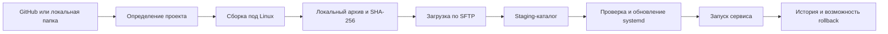

<p align="center"></p>
<h1 align="center">KK.Var</h1>
<p align="center"><strong>Простой локальный CI/CD для доставки приложений на Linux-машины</strong></p>
<p align="center"><a href="README.md">Русский</a> · <a href="README.en.md">English</a></p>
<p align="center">
  
  
  
  
</p>

> [!IMPORTANT]
> KK.Var находится в активной разработке. Стабильный релиз ещё не опубликован. Сейчас управляющее приложение поддерживает только Windows, а deploy выполняется на Linux-машины с systemd.


## Идея

KK.Var — настольное приложение для небольших проектов, которым не нужна отдельная CI/CD-инфраструктура. Оно запускается на компьютере разработчика, получает исходный код из GitHub или локальной папки, собирает релиз, хранит его локально и доставляет на удалённую Linux-машину через SSH.

На сервере не требуется устанавливать отдельный агент. KK.Var загружает подготовленный архив, безопасно переключает версию приложения и управляет соответствующим systemd-сервисом.

## Возможности

- проекты из GitHub и локальных каталогов;
- подключение GitHub через OAuth Device Flow;
- автоматическое определение типа проекта;
- сборка .NET и Go под архитектуру удалённой Linux-машины;
- подготовка и развёртывание Python-проектов;
- локальное хранение неизменяемых архивов версий и SHA-256;
- пользовательские теги и описания релизов;
- deploy и rollback из графического интерфейса;
- создание и обновление unit-файла systemd;
- вызов `daemon-reload` только при создании или изменении unit-файла;
- проверка запуска сервиса через `systemctl`;
- история deploy и rollback с поиском и фильтрацией;
- переменные окружения с сохранением заданного порядка;
- JSON, `.env`, Shell и YAML для файла переменных окружения;
- произвольное имя и расположение файла переменных внутри проекта;
- русский и английский интерфейс с переключением без перезапуска;
- локальное хранение настроек и базы SQLite;
- защищённое хранение GitHub-токена средствами Windows DPAPI.

## Как проходит deploy



Во время доставки KK.Var проверяет SSH-доступ, архитектуру и свободное место, загружает релиз во временный каталог и только затем переключает рабочую директорию. Если операция завершается ошибкой после переключения, приложение пытается восстановить предыдущую версию и unit-файл.

Архивы версий остаются на локальном компьютере. Удалённая машина хранит только текущую рабочую версию приложения, поэтому KK.Var подходит и для серверов с ограниченным дисковым пространством.

## Поддерживаемые платформы

| Компонент | Поддержка |
|---|---|
| Управляющее приложение | Windows |
| Целевая машина | Linux с systemd |
| Архитектура Linux | x86_64/amd64 и arm64/aarch64 |
| Источник | GitHub или локальная папка Windows |

Версии для Linux и macOS сейчас не выпускаются: GitHub-токен хранится через Windows DPAPI, а текущее тестирование приложения ориентировано на Windows.

## Поддерживаемые проекты

| Тип | Автоопределение | Текущее поведение |
|---|---:|---|
| .NET | ✅ | `dotnet publish` в Release, self-contained сборка для `linux-x64` или `linux-arm64` |
| Go | ✅ | `go build` с `GOOS=linux`, целевая архитектура определяется автоматически |
| Python | ✅ | исходники доставляются на сервер, создаётся `.venv`, устанавливаются зависимости |
| C++ | ✅ | проект распознаётся, автоматический Linux cross-toolchain пока не реализован |
| Свой сценарий | вручную | зарезервирован для будущих пользовательских команд сборки |

KK.Var ищет `.sln`/`.slnx` и `.csproj`, `go.mod`, `pyproject.toml`, `requirements.txt`, Python-файлы, `CMakeLists.txt` и C++-исходники. Если найдено несколько подходящих вариантов, способ сборки нужно выбрать вручную.

## Проекты и версии

У проекта хранятся источник, способ сборки, имя systemd-сервиса, удалённая директория, исполняемый файл и путь к файлу переменных окружения. После успешной сборки создаётся локальная версия с пользовательским тегом, описанием, архивом, контрольной суммой и ссылкой на исходный commit, если проект получен из GitHub.


Rollback использует уже сохранённый локальный архив выбранной версии: повторно получать исходники и собирать проект не требуется.

## Переменные окружения

Переменные задаются отдельно для каждого проекта, сохраняются в установленном пользователем порядке и записываются в выбранный файл во время deploy. Путь не ограничен именами `.env` или `environment`: можно указать, например, `config/appsettings.Production.json` или `config/runtime.env`.


Переменные окружения в KK.Var не предназначены для хранения секретов. Пароли, приватные ключи и другие чувствительные данные не следует добавлять в проектные переменные.

## Требования

### Локальный компьютер

- Windows;
- .NET 10 SDK для сборки KK.Var из исходного кода;
- установленный toolchain для собираемого проекта: .NET SDK или Go;
- доступ к GitHub, если используется репозиторий GitHub;
- сетевой доступ к целевой Linux-машине.

### Удалённая машина

- Linux с systemd;
- SSH и SFTP;
- `systemctl` и `tar`;
- пользователь с возможностью выполнять необходимые команды через `sudo` без интерактивного запроса пароля;
- `python3`, модуль `venv` и `pip` для Python-проектов.

KK.Var определяет архитектуру командой `uname -m` во время проверки SSH-подключения — вводить её вручную не требуется.

## Сборка из исходного кода

```powershell
git clone https://github.com/KavvaiiKira/KK.Var.git
cd KK.Var
dotnet restore
dotnet run --project KK.Var/KK.Var.csproj
```

## Первый запуск

При первом запуске приложение откроет мастер настройки. Для начала работы необходимо указать:

1. адрес Linux-машины и SSH-порт;
2. имя пользователя;
3. способ аутентификации — приватный SSH-ключ или пароль;
4. проверить подключение и сохранить настройки.

GitHub можно подключить сразу или позже. Авторизация проходит через Device Flow: приложение показывает одноразовый код и открывает страницу GitHub, а полученный токен сохраняется локально в зашифрованном виде.


## Локальные данные

Данные приложения находятся в `%LOCALAPPDATA%\KK.Var`:

- `settings.json` — настройки приложения и подключения;
- `kk-var.db` — проекты, версии, переменные и история операций;
- `artifacts` — локальные архивы версий;
- `logs` — диагностические журналы;
- `github-token.dat` — GitHub-токен, защищённый Windows DPAPI.

Перед публикацией диагностических журналов проверяйте их содержимое. Файл `github-token.dat` нельзя переносить в репозиторий или передавать другим пользователям.

## Ограничения текущей версии

- управляющее приложение работает только на Windows;
- deploy предназначен только для Linux и systemd-сервисов;
- C++ cross-compilation и пользовательские сценарии сборки ещё не реализованы;
- KK.Var не управляет миграциями и резервными копиями баз данных развёртываемых приложений;
- удалённая машина должна быть заранее доступна по SSH и позволять необходимые команды `sudo`.

## Лицензия

Исходный код распространяется по лицензии [MIT](LICENSE).
