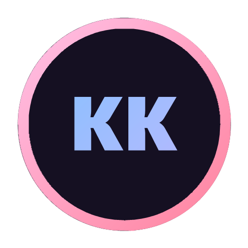
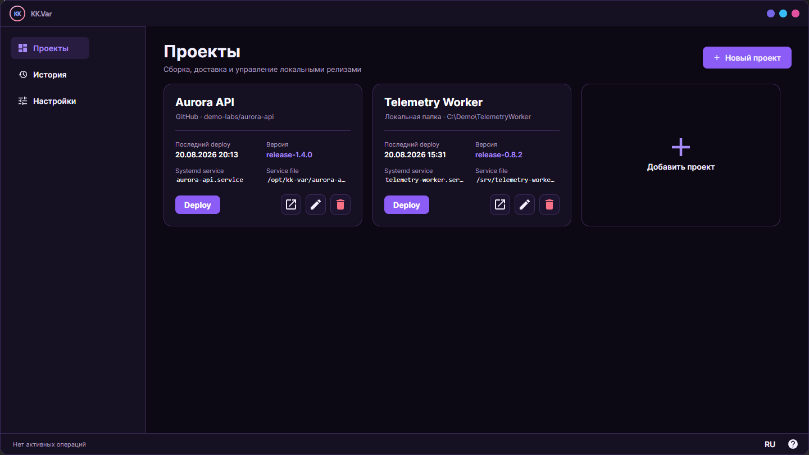
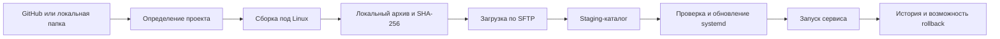
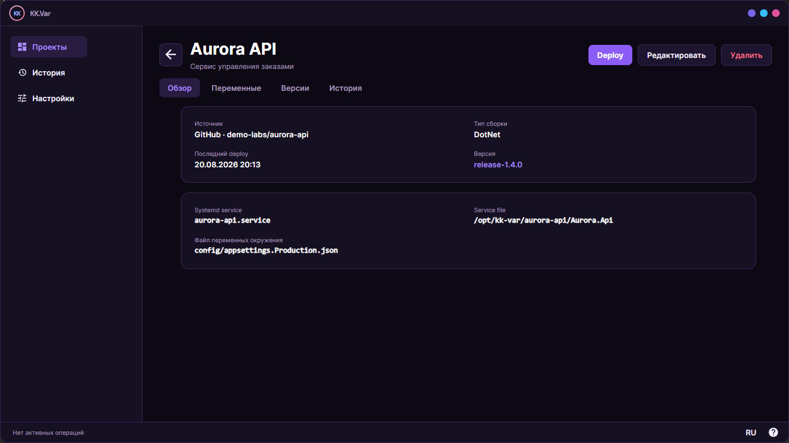
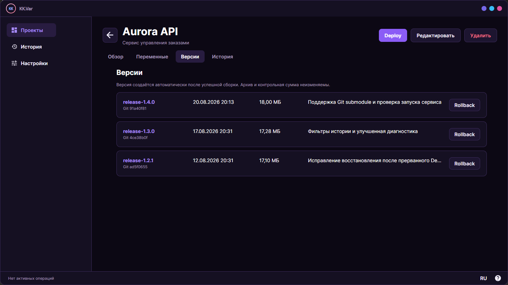
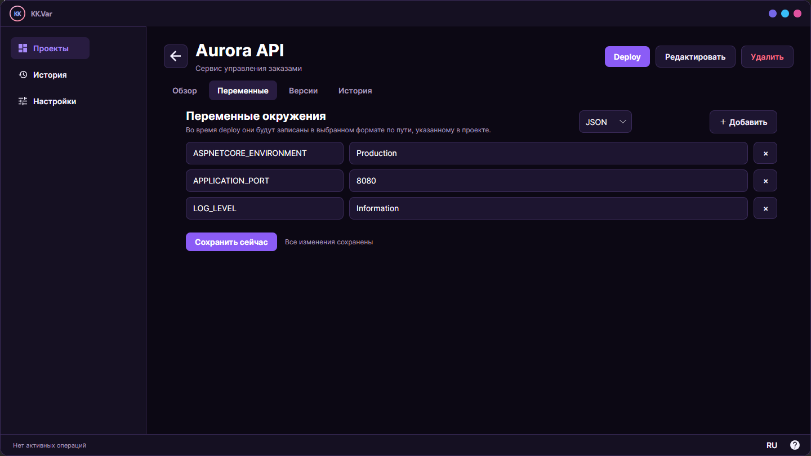
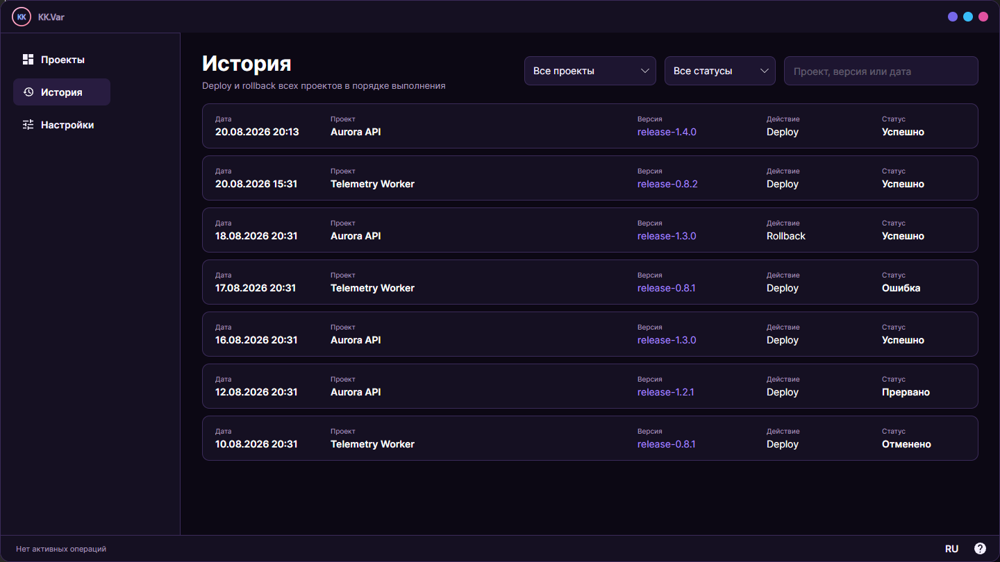
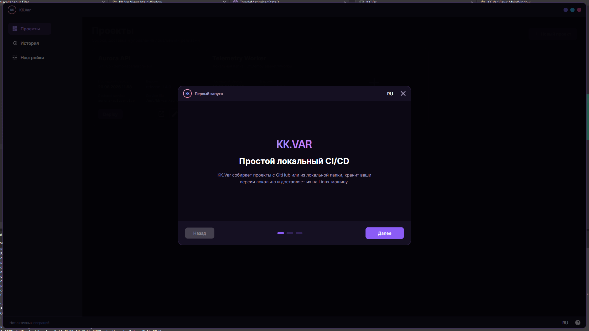
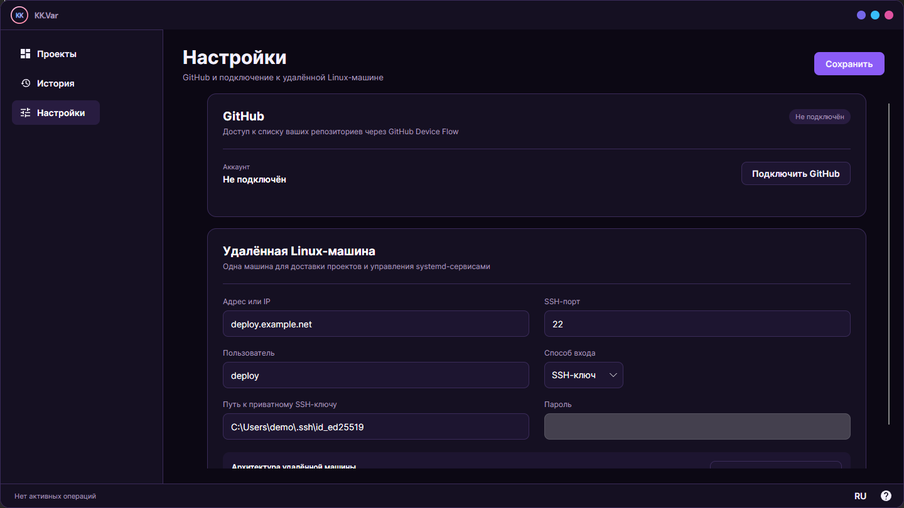

<p align="center"></p>
<h1 align="center">KK.Var</h1>
<p align="center"><strong>Простой локальный CI/CD для доставки приложений на Linux-машины</strong></p>
<p align="center"><a href="README.md">Русский</a> · <a href="README.en.md">English</a></p>
<p align="center">
  
  
  
  
</p>

> [!IMPORTANT]
> KK.Var 0.1.0 - первый публичный релиз. Управляющее приложение поддерживает только Windows, а deploy выполняется на Linux-машины с systemd.



## Идея

KK.Var - настольное приложение для небольших проектов, которым не нужна отдельная CI/CD-инфраструктура. Оно запускается на компьютере разработчика, получает исходный код из GitHub или локальной папки, собирает релиз, хранит его локально и доставляет на удалённую Linux-машину через SSH.

На сервере не требуется устанавливать отдельный агент. KK.Var загружает подготовленный архив, безопасно переключает версию приложения и управляет соответствующим systemd-сервисом.

## Возможности

- проекты из GitHub и локальных каталогов;
- загрузка GitHub-репозиториев вместе с Git submodule;
- подключение GitHub через OAuth Device Flow;
- автоматическое определение типа проекта;
- сборка .NET, Go и C++ под архитектуру удалённой Linux-машины;
- подготовка и развёртывание Python-проектов;
- пользовательский сценарий сборки для других типов проектов;
- локальное хранение неизменяемых архивов версий, SHA-256 и Git commit SHA для GitHub-источников;
- пользовательские теги и описания релизов;
- deploy и rollback из графического интерфейса;
- восстановление незавершённого deploy после аварийного закрытия приложения;
- создание и обновление unit-файла systemd;
- вызов `daemon-reload` только при создании или изменении unit-файла;
- проверка запуска сервиса через `systemctl`;
- история deploy и rollback с поиском, фильтрацией по проекту и статусу и постраничной загрузкой;
- переменные окружения с сохранением заданного порядка;
- JSON, `.env`, Shell и YAML для файла переменных окружения;
- произвольное имя и расположение файла переменных внутри проекта;
- русский и английский интерфейс с переключением без перезапуска;
- локальное хранение настроек и базы SQLite;
- защищённое хранение GitHub-токена и SSH-пароля средствами Windows DPAPI;
- подтверждение и последующая проверка отпечатка SSH-сервера;
- дополнительные параметры и переменные среды процесса сборки через JSON-конфигурацию.

## Как проходит deploy



Во время доставки KK.Var проверяет SSH-доступ, архитектуру и свободное место, загружает релиз во временный каталог и только затем переключает рабочую директорию. Если операция завершается ошибкой после переключения, приложение пытается восстановить предыдущую версию и unit-файл.

Архивы версий остаются на локальном компьютере. Удалённая машина хранит только текущую рабочую версию приложения, поэтому KK.Var подходит и для серверов с ограниченным дисковым пространством.

## Поддерживаемые платформы

| Компонент | Поддержка |
|---|---|
| Управляющее приложение | Windows |
| Целевая машина | Linux с systemd |
| Архитектура Linux | x86_64/amd64 и arm64/aarch64 |
| Источник | GitHub или локальная папка Windows |

Версии для Linux и macOS сейчас не выпускаются: GitHub-токен хранится через Windows DPAPI, а текущее тестирование приложения ориентировано на Windows.

## Поддерживаемые проекты

| Тип | Автоопределение | Текущее поведение |
|---|---:|---|
| .NET | ✅ | `dotnet publish`, по умолчанию Release и self-contained для `linux-x64` или `linux-arm64` |
| Go | ✅ | `go build` с `GOOS=linux`, целевая архитектура определяется автоматически |
| Python | ✅ | исходники доставляются на сервер, создаётся `.venv`, устанавливаются зависимости |
| C++ | ✅ | CMake-сборка с указанным пользователем Linux toolchain-файлом |
| Свой сценарий | вручную | прямая пользовательская команда с контролируемым выходным каталогом |

KK.Var ищет `.sln`/`.slnx` и `.csproj`, `go.mod`, `pyproject.toml`, `requirements.txt`, Python-файлы, `CMakeLists.txt` и C++-исходники. Если найдено несколько подходящих вариантов, способ сборки нужно выбрать вручную.

### Параметры сборки

В проекте можно передать дополнительные параметры в формате JSON:

```json
{
  "configuration": "Release",
  "configureArguments": [],
  "buildArguments": ["--verbosity", "minimal"],
  "environment": {
    "NUGET_XMLDOC_MODE": "skip"
  }
}
```

`configuration` задаёт конфигурацию, `buildArguments` добавляются к `dotnet publish`, `go build`, `cmake --build` или `pip install`, а `environment` применяется к локальному процессу сборки. Для C++ дополнительно задаются `toolchainFile`, `cmakeGenerator` и `configureArguments`.

Пользовательская сборка задаётся полями `command`, `workingDirectory` и `buildArguments`. Доступны подстановки `{source}`, `{output}`, `{runtime}` и `{architecture}`, а также одноимённые переменные `KKVAR_*`. Команда обязана поместить готовые файлы в `{output}`. Она запускается напрямую, без неявного `cmd.exe`.

## Проекты и версии

У проекта хранятся источник, способ сборки, имя systemd-сервиса, удалённая директория, исполняемый файл и путь к файлу переменных окружения. После успешной сборки создаётся локальная версия с пользовательским тегом, описанием, архивом, контрольной суммой и Git commit SHA для GitHub-источника.

**Обзор проекта**



**Локально сохранённые версии и Rollback**



Rollback использует уже сохранённый локальный архив выбранной версии: повторно получать исходники и собирать проект не требуется.

## Переменные окружения

Переменные задаются отдельно для каждого проекта, сохраняются в установленном пользователем порядке и записываются в выбранный файл во время deploy. Путь не ограничен именами `.env` или `environment`: можно указать, например, `config/appsettings.Production.json` или `config/runtime.env`.



Переменные окружения в KK.Var не предназначены для хранения секретов. Пароли, приватные ключи и другие чувствительные данные не следует добавлять в проектные переменные.

## История операций

Общая история объединяет Deploy и Rollback всех проектов. Её можно фильтровать по проекту и статусу, а поиск принимает имя проекта, тег версии или дату. Записи загружаются постранично и показывают как успешные, так и завершившиеся ошибкой, прерванные или отменённые операции.



## Требования

### Локальный компьютер

- Windows;
- .NET 10 SDK для сборки KK.Var из исходного кода;
- установленный toolchain для собираемого проекта: .NET SDK или Go;
- CMake, Ninja и Linux cross-toolchain для C++-проектов;
- доступ к GitHub, если используется репозиторий GitHub;
- сетевой доступ к целевой Linux-машине.

### Удалённая машина

- Linux с systemd;
- SSH и SFTP;
- `systemctl` и `tar`;
- пользователь с возможностью выполнять необходимые команды через `sudo` без интерактивного запроса пароля;
- `python3`, модуль `venv` и `pip` для Python-проектов.

KK.Var определяет архитектуру командой `uname -m` во время проверки SSH-подключения - вводить её вручную не требуется.

## Установка

1. Откройте страницу [GitHub Releases](https://github.com/KavvaiiKira/KK.Var/releases/latest).
2. Скачайте `KK.Var-0.1.0-win-x64.zip` для обычной 64-разрядной Windows или `KK.Var-0.1.0-win-x86.zip`, если требуется 32-разрядная версия.
3. При необходимости сверьте SHA-256 архива со значением в описании релиза.
4. Распакуйте архив в отдельную директорию и запустите `KK.Var.exe`.

Готовая сборка является self-contained: устанавливать .NET Runtime или .NET SDK для запуска KK.Var не требуется. Поскольку первый релиз не подписан коммерческим сертификатом, Windows SmartScreen может показать предупреждение о неизвестном издателе. Проверьте, что архив скачан со страницы релизов этого репозитория, и сверьте его SHA-256.

## Сборка из исходного кода

```powershell
git clone https://github.com/KavvaiiKira/KK.Var.git
cd KK.Var
dotnet restore
dotnet run --project KK.Var/KK.Var.csproj
```

Для создания self-contained архивов релиза выполните:

```powershell
.\build-release.ps1
```

Скрипт создаёт `KK.Var-0.1.0-win-x86.zip` для 32-разрядной Windows и `KK.Var-0.1.0-win-x64.zip` для 64-разрядной Windows в `artifacts/release`. .NET SDK пользователю готовых архивов не требуется.

## Первый запуск

При первом запуске приложение откроет мастер настройки. Для начала работы необходимо указать:

1. адрес Linux-машины и SSH-порт;
2. имя пользователя;
3. способ аутентификации - приватный SSH-ключ или пароль;
4. сверить и подтвердить отпечаток SSH-сервера;
5. проверить подключение и сохранить настройки.

GitHub можно подключить сразу или позже. Авторизация проходит через Device Flow: приложение показывает одноразовый код и открывает страницу GitHub, а полученный access token сохраняется локально в зашифрованном виде. Если GitHub отзовёт токен или пользователь отзовёт доступ в настройках аккаунта, GitHub потребуется подключить заново.

Для доступа к приватным репозиториям OAuth App запрашивает scopes `repo read:user`. GitHub описывает `repo` как полный доступ к приватным репозиториям, хотя KK.Var использует этот токен только для чтения списка репозиториев, commit SHA, деревьев Git, submodule и архивов исходного кода. Доступ можно отозвать в настройках подключённых приложений GitHub или кнопкой отключения GitHub в настройках KK.Var.



После мастера настройки доступны на отдельной странице: здесь можно изменить SSH-подключение, проверить удалённую машину и подключить или отключить GitHub.



## Локальные данные

Данные приложения находятся в `%LOCALAPPDATA%\KK.Var`:

- `settings.json` - настройки приложения и подключения без SSH-пароля;
- `kk-var.db` - проекты, версии, переменные и история операций;
- `artifacts` - локальные архивы версий;
- `logs` - диагностические журналы;
- `github-token.dat` - GitHub-токен, защищённый Windows DPAPI;
- `ssh-password.dat` - SSH-пароль, защищённый Windows DPAPI;
- `recovery` - резервные копии повреждённых настроек или SQLite-базы, созданные пользователем через экран восстановления.

При повреждении `settings.json` или ошибке открытия SQLite приложение показывает экран восстановления вместо аварийного завершения. Сброс выполняется только по подтверждению, а исходные файлы сохраняются в `recovery`.

Удаление проекта также удаляет принадлежащие ему локальные архивы версий.

Перед публикацией диагностических журналов проверяйте их содержимое. Файлы `github-token.dat` и `ssh-password.dat` нельзя переносить в репозиторий или передавать другим пользователям.

## Ограничения текущей версии

- управляющее приложение работает только на Windows;
- deploy предназначен только для Linux и systemd-сервисов;
- одновременно выполняется только один deploy или rollback;
- KK.Var не управляет миграциями и резервными копиями баз данных развёртываемых приложений;
- удалённая машина должна быть заранее доступна по SSH и позволять необходимые команды `sudo`.

## Лицензия

Исходный код распространяется по лицензии [MIT](LICENSE).

### Лицензии сторонних компонентов

- шрифт [Exo 2](https://github.com/googlefonts/Exo-2.0) распространяется по лицензии SIL Open Font License 1.1; полный текст находится в [`KK.Var/Assets/Fonts/Exo2-OFL.txt`](KK.Var/Assets/Fonts/Exo2-OFL.txt);
- шрифт [Inter](https://github.com/rsms/inter) распространяется по лицензии [SIL Open Font License 1.1](https://github.com/rsms/inter/blob/master/LICENSE.txt) и подключается через пакет `Avalonia.Fonts.Inter`.
